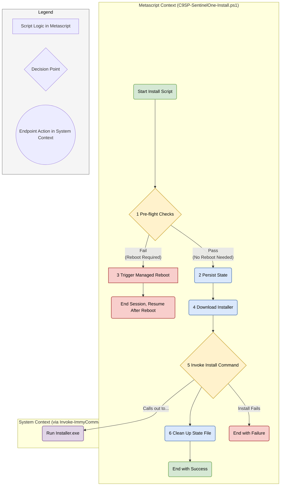

# C9SP-SentinelOne-Install.ps1

```mermaid
flowchart TD
    %% --- Subgraphs for Clarity ---
    subgraph MetascriptContext["Metascript Context (C9SP-SentinelOne-Install.ps1)"]
        direction LR
        Start(Start Install Script) --> PreFlight{1 Pre-flight Checks}
        PreFlight -- "Pass<br/>(No Reboot Needed)" --> State(2 Persist State)
        PreFlight -- "Fail<br/>(Reboot Required)" --> Reboot[3 Trigger Managed Reboot]
        Reboot --> Stop1(End Session, Resume After Reboot)

        State --> Download(4 Download Installer)
        Download --> Install{5 Invoke Install Command}
        Install --> Cleanup(6 Clean Up State File)
        Cleanup --> Success(End with Success)
        
        Install -- "Install Fails" --> Failure(End with Failure)
    end
    
    subgraph SystemContext["System Context (via Invoke-ImmyCommand)"]
        direction LR
        ActualInstall(Run Installer.exe)
    end

    %% --- Node Details & Logic ---
    subgraph Legend
        direction LR
        box1[Script Logic in Metascript]
        box2{Decision Point}
        box3((Endpoint Action in System Context))
    end
    
    %% --- Connections ---
    Install --> |"Calls out to..."| ActualInstall

    %% --- Styling (Dark Theme Compatible) ---
    style Start fill:#d5e8d4,stroke:#82b366,stroke-width:2px,color:#000000
    style PreFlight fill:#fff2cc,stroke:#d6b656,stroke-width:2px,color:#000000
    style Reboot fill:#f8cecc,stroke:#b85450,stroke-width:2px,color:#000000
    style State fill:#dae8fc,stroke:#6c8ebf,stroke-width:2px,color:#000000
    style Download fill:#dae8fc,stroke:#6c8ebf,stroke-width:2px,color:#000000
    style Install fill:#fff2cc,stroke:#d6b656,stroke-width:2px,color:#000000
    style Cleanup fill:#dae8fc,stroke:#6c8ebf,stroke-width:2px,color:#000000
    style Success fill:#d5e8d4,stroke:#82b366,stroke-width:2px,color:#000000
    style Failure fill:#f8cecc,stroke:#b85450,stroke-width:2px,color:#000000
    style Stop1 fill:#f8cecc,stroke:#b85450,stroke-width:2px,color:#000000
    style ActualInstall fill:#e1d5e7,stroke:#9673a6,stroke-width:2px,color:#000000
    style Legend fill:#f5f5f5,stroke:#666,stroke-width:1px,color:#000
```
