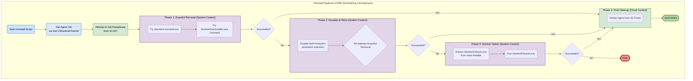

# C9SP-SentinelOne-Uninstall.ps1

```mermaid
flowchart TD
    subgraph "Uninstall Playbook (C9SP-SentinelOne-Uninstall.ps1)"
        Start(Start Uninstall Script) --> GetInfo(Get Agent Info<br/>via Get-C9SentinelOneInfo)
        GetInfo --> GetToken(Attempt to Get Passphrase<br/>from S1 API)
        
        GetToken --> A{Attempt Graceful Removal}
        subgraph A["Phase 1: Graceful Removal (System Context)"]
            direction LR
            A1(Try standard uninstall.exe) --> A2(Try SentinelOneInstaller.exe /uninstall)
        end

        A --> B{Succeeded?}
        B -- No --> C{Attempt Unprotect}
        B -- Yes --> F{API Cleanup}

        subgraph C["Phase 2: Escalate & Retry (System Context)"]
            direction LR
            C1(Disable Self-Protection<br/>sentinelctl unprotect) --> C2{Re-Attempt Graceful Removal}
        end

        C --> D{Succeeded?}
        D -- No --> E{Nuclear Option}
        D -- Yes --> F

        subgraph E["Phase 3: Nuclear Option (System Context)"]
            direction LR
            E1(Extract SentinelCleaner.exe<br/>from main installer) --> E2(Run SentinelCleaner.exe)
        end
        
        E --> G{Succeeded?}
        G -- No --> Failure([FAIL])
        G -- Yes --> F
        
        subgraph F["Phase 4: Post-Cleanup (Cloud Context)"]
            direction LR
            F1(Delete Agent from S1 Portal)
        end

        F --> Success([SUCCESS])
    end

    %% --- Styling (Dark Theme Compatible) ---
    style Start fill:#cde4ff,stroke:#6a8ebf,stroke-width:2px,color:#000000
    style GetInfo fill:#dae8fc,stroke:#6c8ebf,stroke-width:2px,color:#000000
    style GetToken fill:#d5e8d4,stroke:#82b366,stroke-width:2px,color:#000000
    style A fill:#e1d5e7,stroke:#9673a6,stroke-width:2px,color:#000000
    style C fill:#e1d5e7,stroke:#9673a6,stroke-width:2px,color:#000000
    style E fill:#e1d5e7,stroke:#9673a6,stroke-width:2px,color:#000000
    style F fill:#d5e8d4,stroke:#82b366,stroke-width:2px,color:#000000
    style Success fill:#b6d7a8,stroke:#6a8e3c,stroke-width:3px,color:#000
    style Failure fill:#ea9999,stroke:#990000,stroke-width:3px,color:#000
```
