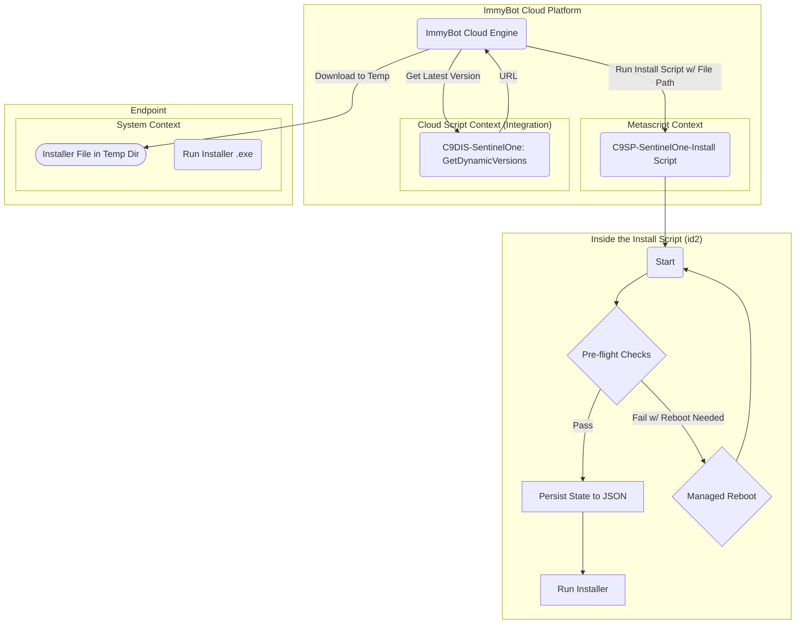

```mermaid
flowchart TD
    subgraph "ImmyBot Cloud Platform"
        Engine(ImmyBot Cloud Engine)
        subgraph "Metascript Context"
            id2(C9SP-SentinelOne-Install Script)
        end
        subgraph "Cloud Script Context (Integration)"
            GetVersions(C9DIS-SentinelOne: GetDynamicVersions)
        end
    end

    subgraph "Endpoint"
        subgraph "System Context"
            InstallerFile([Installer File in Temp Dir])
            ActualInstall(Run Installer .exe)
        end
    end

    %% --- Flow ---
    Engine -->|"Get Latest Version"| GetVersions
    GetVersions -->|"URL"| Engine
    Engine -->|"Download to Temp"| InstallerFile
    Engine -->|"Run Install Script w/ File Path"| id2

    subgraph "Inside the Install Script (id2)"
        A(Start) --> B{Pre-flight Checks};
        B -- Pass --> D[Persist State to JSON];
        D --> E[Run Installer];
        B -- Fail w/ Reboot Needed --> C{Managed Reboot};
        C --> A;
    end

    id2 --> A;
```