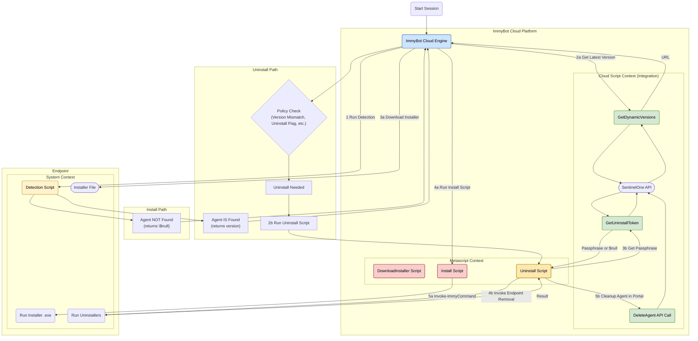

# SentinelOne Flow Diagram

```mermaid
flowchart TD
    subgraph "ImmyBot Cloud Platform"
        Engine(ImmyBot Cloud Engine)
        
        subgraph "Metascript Context"
            DownloadScript(DownloadInstaller Script)
            InstallScript(Install Script)
            UninstallScript(Uninstall Script)
        end

        subgraph "Cloud Script Context (Integration)"
            GetVersions(GetDynamicVersions)
            GetPassphrase(GetUninstallToken)
            DeleteAgent(DeleteAgent API Call)
            S1API([SentinelOne API])
        end
    end

    subgraph "Endpoint"
        subgraph "System Context"
            Detection(Detection Script)
            InstallerFile([Installer File])
            ActualInstall(Run Installer .exe)
            AttemptRemoval(Run Uninstallers)
        end
    end

    %% --- High-Level Flow ---
    Start(Start Session) --> Engine
    Engine -->|"1 Run Detection"| Detection

    subgraph "Install Path"
        Detection --> AgentNotFound["Agent NOT Found\n(returns \$null)"] --> Engine
        Engine -->|"2a Get Latest Version"| GetVersions
        GetVersions --> S1API
        S1API --> GetVersions
        GetVersions -->|"URL"| Engine
        Engine -->|"3a Download Installer"| InstallerFile
        Engine -->|"4a Run Install Script"| InstallScript
        InstallScript -->|"5a Invoke-ImmyCommand"| ActualInstall
    end

    subgraph "Uninstall Path"
        Detection --> AgentIsFound["Agent IS Found\n(returns version)"] --> Engine
        Engine --> Policy{"Policy Check\n(Version Mismatch, Uninstall Flag, etc.)"}
        Policy --> UninstallNeeded["Uninstall Needed"] --> RunUninstallScript["2b Run Uninstall Script"] --> UninstallScript
        UninstallScript -->|"3b Get Passphrase"| GetPassphrase
        GetPassphrase --> S1API
        S1API --> GetPassphrase
        GetPassphrase -->|"Passphrase or $null"| UninstallScript
        UninstallScript -->|"4b Invoke Endpoint Removal"| AttemptRemoval
        AttemptRemoval -->|"Result"| UninstallScript
        UninstallScript -->|"5b Cleanup Agent in Portal"| DeleteAgent
        DeleteAgent --> S1API
    end
    
    %% --- Styling (Dark Theme Compatible) ---
    style Engine fill:#cde4ff,stroke:#6a8ebf,stroke-width:2px,color:#000000
    style GetVersions fill:#d5e8d4,stroke:#82b366,stroke-width:2px,color:#000000
    style DownloadScript fill:#f8cecc,stroke:#b85450,stroke-width:2px,color:#000000
    style InstallScript fill:#f8cecc,stroke:#b85450,stroke-width:2px,color:#000000
    style Detection fill:#fff2cc,stroke:#d6b656,stroke-width:2px,color:#000000
    style UninstallScript fill:#fce8b2,stroke:#c49302,stroke-width:2px,color:#000000
    style GetPassphrase fill:#d5e8d4,stroke:#82b366,stroke-width:2px,color:#000000
    style DeleteAgent fill:#d5e8d4,stroke:#82b366,stroke-width:2px,color:#000000
```
